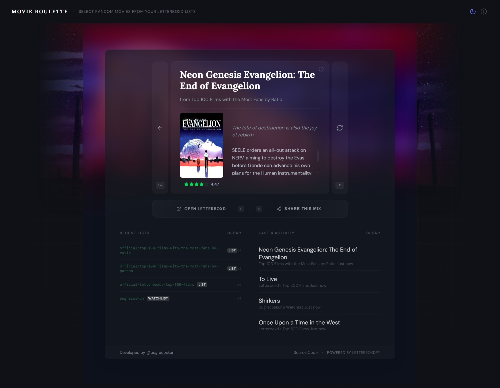

# Movie Roulette 🎬


A simple web application to pick a random movie from Letterboxd lists.

> [!IMPORTANT]
> This repository is maintained as a boilerplate/draft. Most requests may fail during web scraping operations. While it works occasionally, it is not consistently stable, likely due to Cloudflare protection, and further optimization has not been prioritized.

<p align="center">
  <picture>
    <source media="(prefers-color-scheme: dark)" srcset=".github/assets/movie-roulette-dark.jpeg">
    <source media="(prefers-color-scheme: light)" srcset=".github/assets/movie-roulette-light.jpeg">
    
  </picture>
  <br>
  <sub><a href=".github/assets/movie-roulette-dark.jpeg" target="_blank">Dark Mode</a> | <a href=".github/assets/movie-roulette-light.jpeg" target="_blank">Light Mode</a></sub>
</p>

## Local Development

1. Install dependencies:
   ```bash
   pip install -r requirements.txt
   ```
2. Run the server:
   ```bash
   python -m api.index
   ```

## License
MIT
